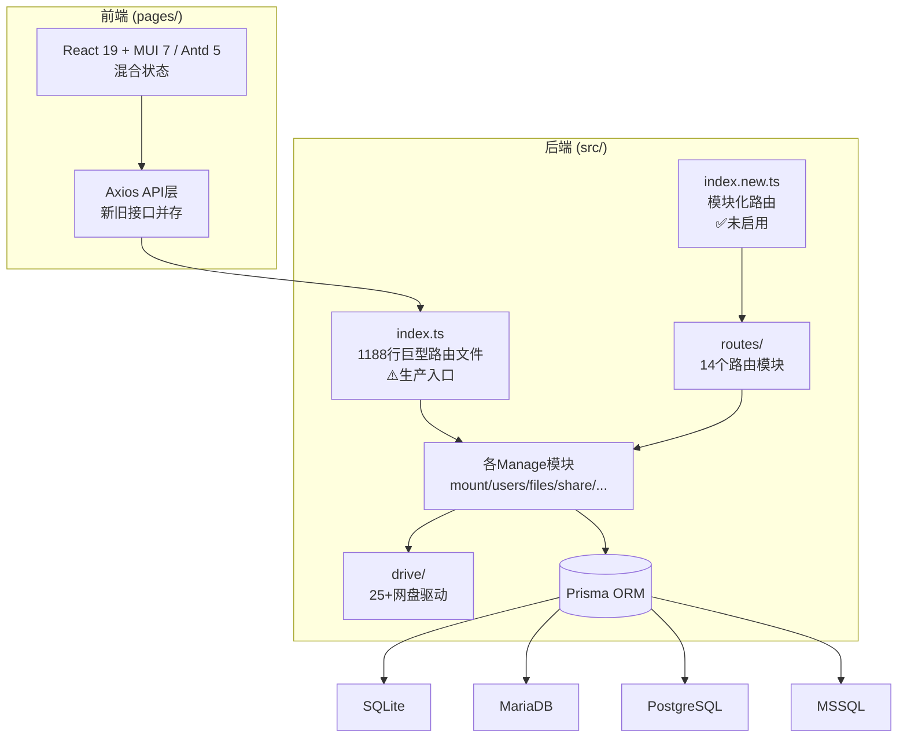

# Code Review 报告 — OpenList-TSWorker 全项目评审

## 1. 基本信息

| 项目 | 内容 |
| :--- | :--- |
| **审查时间** | 2026-02-28 (更新版) |
| **需求关联** | 全项目架构评审与优化重构 |
| **审查范围** | 后端(Hono+Prisma+CF Workers)、前端(React+MUI→Antd)、数据库、文档 |
| **代码变动** | 全量审查：后端入口58KB+14路由模块+25+驱动模块，前端20+组件 |
| **审查结论** | **需要大规模重构** (综合得分: **4.2**/10) |

---

## 2. 架构分析

### 2.1 当前架构概览



### 2.2 docs规划 vs 实际实现对比

| 规划项 (docs/系统结构设置) | 实现状态 | 差距 |
|:--|:--|:--|
| 用户管理-列表 (UUID/名称/分组/密码/空间/权限) | ⚠️部分实现 | 缺少UUID字段、缺少用户分组关联 |
| 分组权限-列表 | ✅已实现 | GroupManage基本完整 |
| 认证方式-列表 | ⚠️部分实现 | OAuth已有，但不支持插件化认证 |
| 私人空间-列表 (负载均衡/保存路径/权重) | ❌未实现 | 完全缺失 |
| 路径规则-列表 (隐藏/压缩/分享/权限/加密元组) | ⚠️部分实现 | MatesManage有基础框架，实际逻辑未完成 |
| 路径管理-列表 | ⚠️部分实现 | 合并在mates中 |
| 索引管理-列表 | ❌未实现 | 完全缺失 |
| 三层代码架构 (用户层→系统层→存储层) | ❌未实现 | 当前为路由→Manage→驱动的扁平结构 |
| 加密组与加解密功能 | ⚠️部分实现 | CryptManage有CRUD，无实际加解密逻辑 |
| 压缩解压功能 | ❌未实现 | 完全缺失 |
| 目录信息配置功能 | ⚠️部分实现 | 数据模型存在，功能未完成 |
| 前端侧边栏 (按系统结构设置的菜单) | ⚠️部分实现 | 结构不匹配规划 |

### 2.3 关键架构问题

| 问题 | 严重性 | 描述 |
|:-----|:------|:-----|
| 巨型入口文件 | 🛑严重 | `src/index.ts` 58KB/1188行包含所有路由，`index.new.ts`已拆分但未启用 |
| 缺乏三层架构 | 🛑严重 | docs规划了用户层→系统层→存储层，实际代码为路由→Manage→驱动的扁平结构 |
| 前后端UI库混乱 | 🛑严重 | App.tsx仍使用MUI(ThemeProvider/CssBaseline)，但package.json和部分组件已引入Antd |
| API层新旧并存 | ⚠️重要 | api.ts同时存在旧版(`getFiles`/`createFolder`)和新版(`getFileList`/`removeFile`)接口 |
| 文档与代码严重不一致 | ⚠️重要 | docs规划完善，但代码实现远未跟上 |
| 权限系统未完成 | ⚠️重要 | FileMask 16位权限掩码仅在docs中定义，代码中未实现 |
| wrangler.jsonc指向旧入口 | 🛑严重 | `main: "src/index.ts"` 指向巨型旧文件而非模块化的新文件 |

---

## 3. 代码质量与复杂度分析

### 3.1 后端复杂度

| 文件 | 大小 | 行数 | 圈复杂度(估) | 状态 |
| :--- | :--- | :--- | :--- | :--- |
| `src/index.ts` | 58.8KB | 1188 | ~80+ | 🛑严重超标 |
| `src/drive/cloud139/files.ts` | 59.5KB | ~1500+ | ~60+ | 🛑严重超标 |
| `src/drive/cloud189/files.ts` | 40.7KB | ~1000+ | ~50+ | 🛑超标 |
| `src/drive/baiduyun/files.ts` | 31.4KB | ~800+ | ~40+ | 🛑超标 |
| `src/drive/cloud115/files.ts` | 28KB | ~700+ | ~35+ | ⚠️超标 |
| `src/oauth/TokenManage.ts` | 24.9KB | ~600+ | ~30+ | ⚠️超标 |
| `src/users/UsersManage.ts` | 23.5KB | ~580+ | ~25+ | ⚠️超标 |
| `src/drive/DriveSelect.ts` | 19.7KB | ~500+ | ~25+ | ⚠️超标 |

### 3.2 前端复杂度

| 文件 | 大小 | 状态 |
| :--- | :--- | :--- |
| `pages/src/pages/Files/DynamicFileManager.tsx` | 46.4KB | 🛑严重超标 |
| `pages/src/pages/Login/AuthPage.tsx` | 27.3KB | 🛑超标 |
| `pages/src/components/MainLayout.tsx` | 21KB | ⚠️超标 |
| `pages/src/pages/Admin/MountManagement.tsx` | 21.5KB | ⚠️超标 |
| `pages/src/components/FileUploadDialog.tsx` | 16.5KB | ⚠️超标 |
| `pages/src/layouts/AppSidebar.tsx` | 15.9KB | ⚠️超标 |
| `pages/src/components/GroupedSidebar.tsx` | 15KB | ⚠️超标 |

### 3.3 整体评分

| 指标 | 评分 | 说明 |
| :--- | :--- | :--- |
| 命名规范 | 5/10 | 驱动模块统一(const/files/metas/utils)较好，前端混乱 |
| 注释完整性 | 4/10 | 后端路由文件有注释，核心逻辑缺少 |
| 代码结构 | 3/10 | 无三层架构，巨型文件，新旧代码共存 |
| 类型安全 | 5/10 | TypeScript使用了但大量`any`和`Record<string, any>` |
| 错误处理 | 4/10 | 仅`{flag, text}`格式，无错误码体系 |
| 测试覆盖 | 1/10 | 仅有`tests.ts`一个文件，非正式测试 |

---

## 4. 深度代码审查

### 4.1 严重问题 (Critical) 🛑

#### 1. 生产入口仍为巨型文件
- 📍 `wrangler.jsonc:3` → `"main": "src/index.ts"`
- 📝 wrangler配置指向58KB的巨型入口文件。虽然已有`index.new.ts`和`routes/`目录进行了模块化拆分，但未切换使用
- 💡 **修复**: 将`wrangler.jsonc`的main改为`src/index.new.ts`，并完善新入口

#### 2. MUI与Antd混用 — 前端处于断裂状态
- 📍 `pages/src/App.tsx:6-7`
- 📝 App.tsx仍导入并使用MUI的`ThemeProvider`/`CssBaseline`/`createTheme`，但`package.json`已包含antd 5.24.7和`@ant-design/icons`。两套UI库共存导致：
  - 包体积翻倍
  - 主题不一致
  - 组件风格混乱
- 💡 **修复**: 完全移除MUI，统一使用Antd的ConfigProvider + antdTheme

#### 3. 权限检查被注释
- 📍 `src/routes/files.ts:17-18`
  ```typescript
  // const authResult = await UsersManage.checkAuth(c);
  // if (!authResult.flag) return c.json(authResult, 401);
  ```
- 📝 文件操作路由的权限检查完全被注释，任何人都可以操作文件
- 💡 **修复**: 恢复权限检查，并实现统一的认证中间件

#### 4. 两套TokenManage冲突
- 📍 `src/oauth/TokenManage.ts` 和 `src/token/TokenManage.ts`
- 📝 两个同名类分别处理OAuth令牌和连接令牌，在`index.ts`中同时导入会产生命名冲突
- 💡 **修复**: 重命名为`OAuthTokenManage`和`ConnTokenManage`

#### 5. CORS完全开放
- 📍 `src/index.new.ts:42` → `Access-Control-Allow-Origin: *`
- 📝 允许任意来源的跨域请求，生产环境存在安全风险
- 💡 **修复**: 基于配置限制允许的来源域名

### 4.2 重要问题 (Major) ⚠️

#### 1. API响应格式不统一
- 📍 后端: `{flag, text, data?}` 格式
- 📍 前端api.ts同时处理两种格式: `{flag, text}` 和 `{success, message, data}`
- 💡 统一为一种标准格式并增加错误码

#### 2. 前端状态管理分裂
- 📍 `pages/src/store/index.ts` — 使用Zustand (✅好)
- 📍 `pages/src/components/AppContext.tsx` — 使用React Context (冗余)
- 📍 部分组件通过 `window.dispatchEvent` 通信 (❌反模式)
- 💡 统一使用Zustand，移除Context和全局事件

#### 3. 前端vite代理不完整
- 📍 `pages/vite.config.ts`
- 📝 仅代理了`/@mount`/`/@users`/`/@files`/`/@admin`，但后端有14个路由模块，缺少`/@share`/`/@crypt`/`/@mates`/`/@group`/`/@token`/`/@fetch`/`/@oauth`/`/@setup`等
- 💡 使用通配符 `/@*` 统一代理

#### 4. 数据库缺少索引和关系
- 📍 `schema.sql`
- 📝 所有表仅有PRIMARY KEY，缺少：
  - 外键关系（users→group, mates→crypt, share→users等）
  - 复合索引（如mount的is_enabled+index_list）
  - 唯一约束（如binds的oauth_name+binds_user）
- 💡 完善Prisma schema中的关系定义和索引

#### 5. 驱动文件超大且重复代码多
- 📍 `src/drive/cloud139/files.ts` (59.5KB)
- 📝 多个驱动的files.ts包含大量重复的HTTP请求、错误处理、分页逻辑
- 💡 提取`BasicClouds`基类（已存在但未充分利用），将通用逻辑上移

#### 6. 前端侧边栏不匹配系统结构设置
- 📍 `pages/src/components/GroupedSidebar.tsx`
- 📝 当前侧边栏结构不符合`docs/系统结构设置`中定义的菜单层次：
  - 缺少：存储(路径规则/路径管理/索引管理)、用户(认证方式/私人空间)、任务(详细子项)、连接(LDAP/FTP/NFS/SMB)
- 💡 重新按文档规划设计侧边栏

### 4.3 优化建议 (Minor) 💡

- [ ] TypeScript开启strict模式
- [ ] 前端实现路由懒加载(React.lazy + Suspense)
- [ ] 统一日志框架，替换console.log
- [ ] 前端骨架屏加载状态
- [ ] 添加请求频率限制中间件
- [ ] 驱动插件化机制（动态加载）
- [ ] 前端代码分割优化包体积

---

## 5. 专项评估

### 5.1 安全风险 🛡️ (6处)

| 级别 | 问题 | 位置 |
|:--|:--|:--|
| 🛑严重 | CORS完全开放 `*` | `src/index.new.ts:42` |
| 🛑严重 | 文件操作权限检查被注释 | `src/routes/files.ts:17-18` |
| 🛑严重 | console.log输出敏感config | `src/index.ts` 多处 |
| ⚠️重要 | JWT Token明文存储localStorage | `pages/src/posts/api.ts` |
| ⚠️重要 | 无请求频率限制 | 全局缺失 |
| 💡建议 | 密码SHA2可升级为bcrypt | `schema.sql` 注释说明 |

### 5.2 性能问题 🚀 (5处)

| 级别 | 问题 | 影响 |
|:--|:--|:--|
| 🛑严重 | DynamicFileManager.tsx 46KB单组件 | 首屏渲染慢 |
| ⚠️重要 | MUI+Antd双库共存 | 包体积过大(~500KB+) |
| ⚠️重要 | 前端无代码分割 | 全量加载所有页面 |
| ⚠️重要 | 数据库无索引优化 | 查询性能差 |
| 💡建议 | 驱动无缓存策略统一管理 | 重复请求 |

### 5.3 docs文档完善度评估

| 文档 | 完善度 | 评价 |
|:--|:--|:--|
| 系统结构设置 | ★★★★☆ | 核心参考，菜单结构清晰，可直接用于开发 |
| 系统代码架构 | ★★★☆☆ | 三层架构描述清楚，但缺少具体接口定义 |
| 加密流程设计 | ★★★★★ | 非常详细，密钥组/加密识别/配置方式都已定义 |
| 文件架构设计 | ★★★★☆ | FileMask权限系统完整，类图清晰 |
| 文件系统功能 | ★★★☆☆ | 统一接口描述到位，细节可补充 |
| 文件系统架构 | ★★★★☆ | 加密执行流程清晰，后缀规则明确 |
| 存储验证空间 | ★★★★☆ | 签名验证和用户空间设计完整 |
| 后端逻辑梳理 | ★★★★★ | API清单完整，驱动接口明确，数据流清楚 |

---

## 6. 审查总结与评分

### 6.1 维度评分

| 维度 | 得分 | 权重 | 说明 |
| :--- | :--- | :--- | :--- |
| 架构设计 | 3/10 | 30% | 不符合docs三层架构规划，巨型入口未切换 |
| 编程规范 | 5/10 | 20% | TypeScript基本使用，但大量any，风格不统一 |
| 可读性 | 4/10 | 15% | 注释不足，新旧代码共存，文件过大 |
| 复杂度 | 3/10 | 15% | 8+个文件严重超标，最大59KB |
| 安全性 | 3/10 | 10% | CORS全开、权限注释、日志泄露 |
| 功能完整性 | 5/10 | 10% | 基本CRUD完成，但加密/压缩/索引/私人空间未实现 |

**综合得分**: **4.2** / 10

### 6.2 积极方面 ✅

1. **驱动模块设计良好**: 25+种网盘驱动统一使用const/files/metas/utils四文件结构
2. **数据模型完整**: schema.sql定义了13张表，覆盖核心业务
3. **Zustand状态管理**: 前端选择了轻量的Zustand，结构清晰
4. **i18n基础框架**: 已有中英双语包，结构合理可扩展
5. **Antd主题系统**: antdTheme.ts三套主题(浅色/深色/透明)设计完善
6. **文档规划完善**: docs目录的规划质量极高，为重构提供了清晰蓝图
7. **新路由模块已就绪**: routes/目录和index.new.ts已完成模块化拆分

### 6.3 最终结论

OpenList-TSWorker 项目有完善的文档规划和良好的驱动层设计，但存在 **"文档与代码严重脱节"** 的核心问题。需要以docs规划为蓝图进行全面重构：

**优先级排序**:
1. 🔴 **P0**: 切换到新入口(index.new.ts)、修复安全问题、统一UI库到Antd
2. 🟡 **P1**: 实现三层架构(用户层→系统层→存储层)、完善权限系统
3. 🟢 **P2**: 实现加密组/压缩/目录配置功能、重设计前端侧边栏
4. 🔵 **P3**: 索引管理、私人空间、连接模块等高级功能

---

## 附录

### A. 技术栈
- **后端**: Hono 4.10 + Prisma 7.0 + Cloudflare Workers
- **前端**: React 19 + Antd 5.24 + Zustand 5 + Vite 7 + react-i18next
- **数据库**: SQLite (开发) / MariaDB / PostgreSQL / MSSQL
- **驱动**: 25+种网盘(阿里/百度/115/123/189/OneDrive/Google Drive/WebDAV/S3/Seafile...)

### B. 文件统计
- 后端模块: 14个路由 + 11个Manage + 25+个驱动
- 前端页面: 6个目录(Admin/Files/Login/OAuth/Users) + 20+组件
- 数据库表: 13张(mount/users/oauth/binds/crypt/mates/share/token/tasks/fetch/group/cache/admin)
